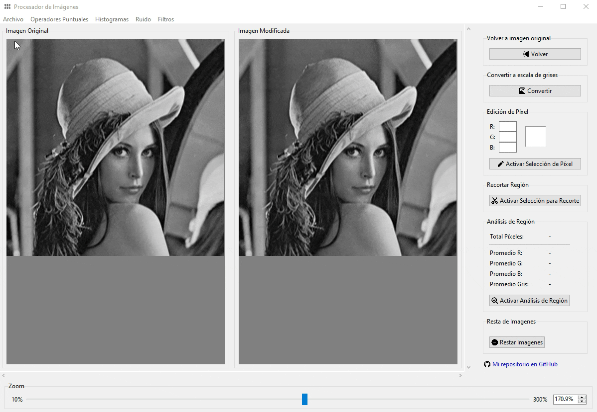

# 🖼️ Procesamiento de Imágenes con Tkinter

¡Bienvenido! 🎉 Este proyecto es una aplicación en **Tkinter** (Python) para **procesamiento de imágenes y visión por computadora**. Permite aplicar filtros, operadores puntuales, histogramas, ruidos y más, visualizar los resultados y guardarlos fácilmente.

## ⬇️ Descarga

Podés descargar la aplicación desde la release oficial:
https://github.com/matias-cisnero/image-processing-app/releases/tag/v1.0.0

## ✨ Funcionalidades
* Operadores puntuales: gamma, umbral, negativo
* Histogramas: visualización y ecualización
* Ruido: gaussiano, Rayleigh, exponencial, sal y pimienta
* Filtros: media, mediana, gaussiano, bordes
* Herramientas: recorte, edición de píxeles, resta de imágenes